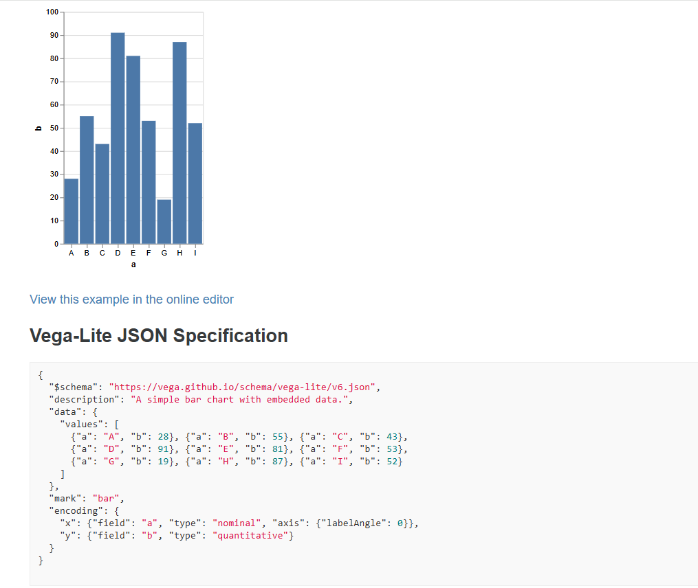
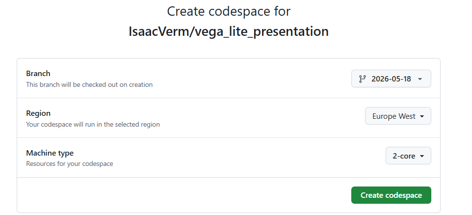
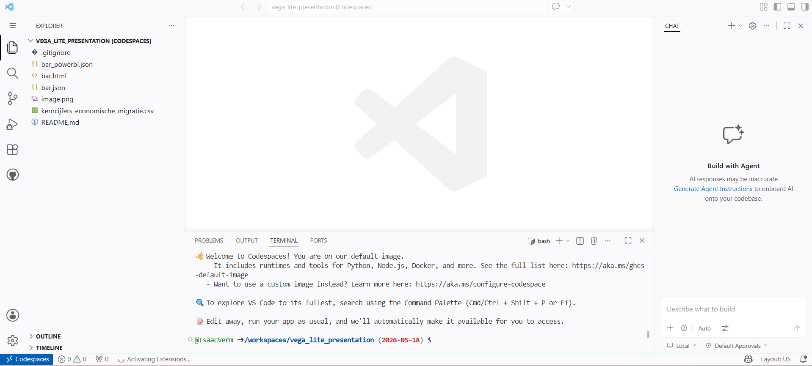
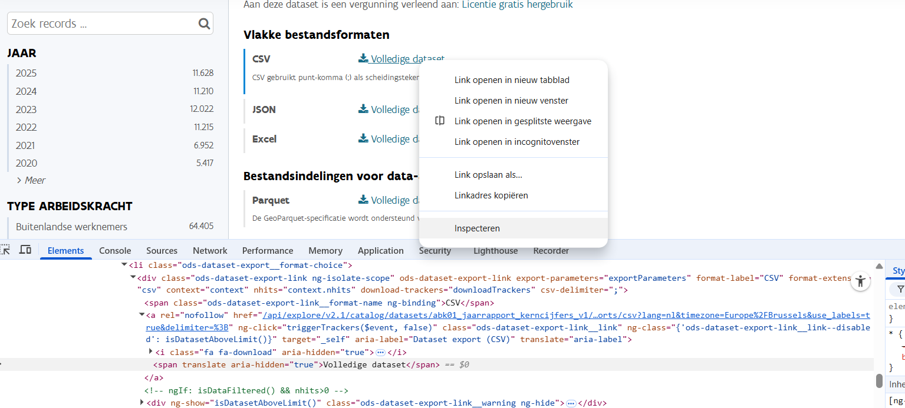
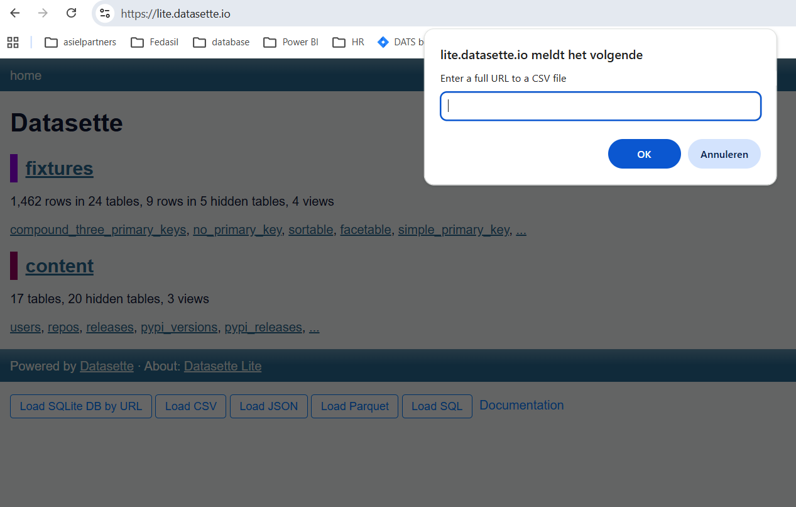
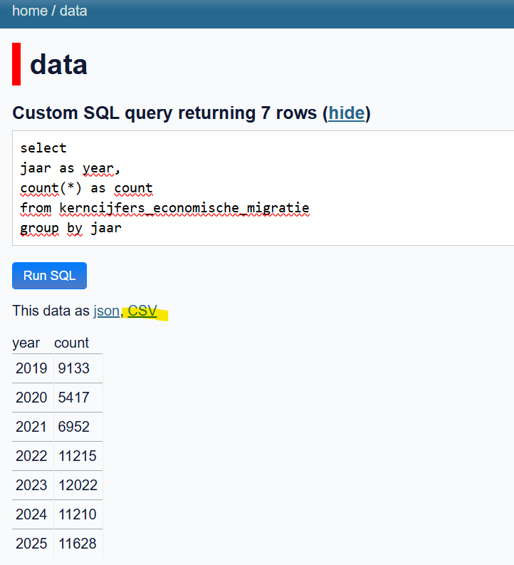
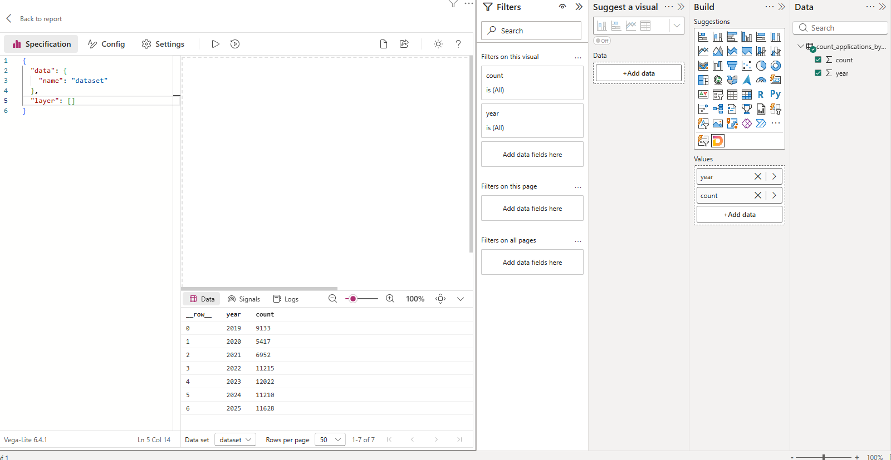
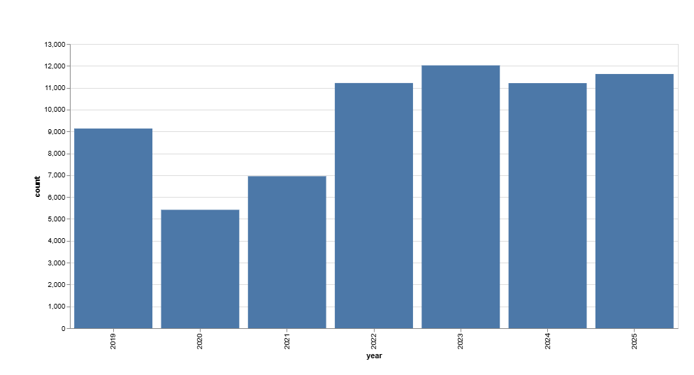
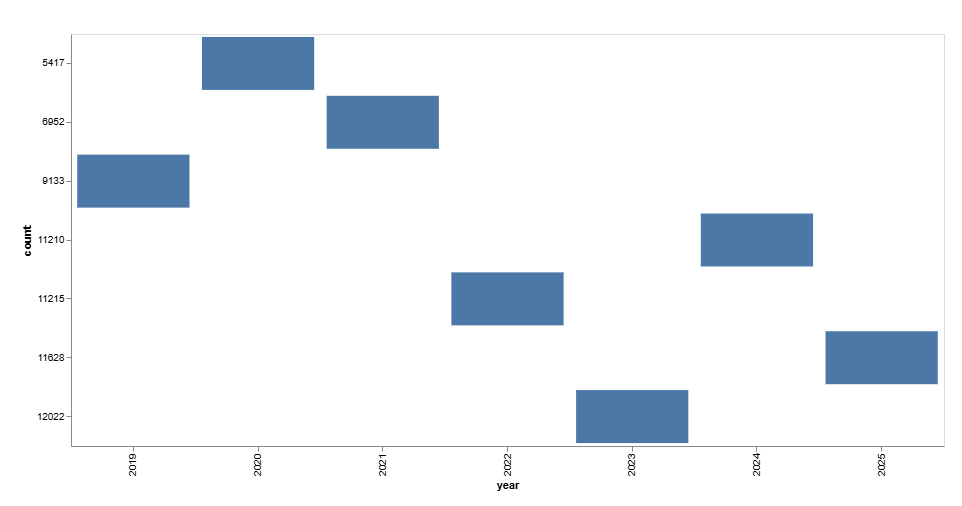
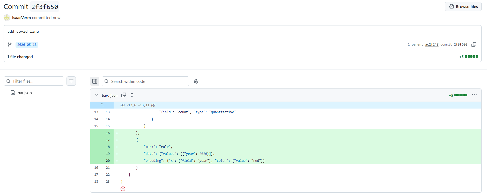

# Use Vega Lite with public data

---

References at the end

---

## What's Vega Lite?

[Official site](https://vega.github.io/vega-lite/):

> Vega-Lite is a high-level grammar of interactive graphics. It provides a concise, declarative JSON syntax to create an expressive range of visualizations for data analysis and presentation.

A way to specify in text how a graph should be build.

[Example bar chart](https://vega.github.io/vega-lite/examples/bar.html):



Here you say: "I want a bar chart (`"mark": "bar"`) with variable a on the x axis and variable b on the y axis:

```
"encoding": {
    "x": {"field": "a"},
    "y": {"field": "b"}
  }
```

- `mark`: the element you want. In this case a bar chart but could also be line or whatever.
- `encoding`: how do you map the data to visual attributes (coordinates in this case).

---

## Demo

Steps to take:

- create coding environment
- fetch data
- inspect data
- pick question to answer
- create a visual in Power BI

Goal is not to show exactly how to do everything in detail but to show how to easily get started.
You can [play with examples](https://vega.github.io/vega-lite/examples/) yourself.

---

### Create coding environment

We're using Windows but I'd like to use some Linux tools for this presentation. Instead of doing the installation myself, you can use GitHub Codespaces to get a basic cloud development environment. This is free but need to create a GitHub account.

Creating the codespace is just a matter of tapping a button:



You end up with a VSCode-like environment in your browser:



---

### Fetch data

I wanted to use some open source migration data.
Datavindplaats (open data Vlaanderen) has a dataset "kerncijfers economische migratie".
Contains applications made for foreigners to work in Belgium.

You open the page and use inspect element to find URL to fetch CSV file from:



You can use `curl` to download and save the file right away:

```sh
curl "https://opendata.wewis.vlaanderen.be/api/explore/v2.1/catalog/datasets/abk01_jaarrapport_kerncijfers_v1/exports/csv?lang=nl&timezone=Europe%2FBrussels&use_labels=true&delimiter=%3B" -o kerncijfers_economische_migratie.csv
```

The data can now be committed and pushed to the GitHub server:

```sh
git add -A
git commit -m "add kerncijfers"
git push
```

---

### Inspect data

Either as raw data in GitHub itself.

Or use Datasette Lite and point it to raw GitHub data just saved:



---

### Pick question to answer

We're interested in the number of demands by year.
Run this query in Datasette Lite:

```sql
select
jaar as year,
count(*) as count
from kerncijfers_economische_migratie
group by jaar
```

When you press the CSV button you can get the raw CSV data you need:



Save manually in the codespace as `count_applications_by_year`.

---

### Bar chart in Power BI

Now we have the data we need, we can move on to the visual itself:

- open new Power BI report with Deneb already installed
- data source Web and use raw Github URL pointing to csv
- create `bar.json` spec and save it to GitHub
- add `bar.json` to Power BI report
- run Deneb to show graph

All default Power BI filters, DAX,... still apply so you can reuse your knowledge.
You can inspect the data received by Deneb before creating the graph as well:



We base the Vega Lite spec on the simple bar chart example.
We add a bar mark and encoding for the x and y axes:

```
{
    "data": {
        "name": "dataset"
    },
    "layer": [
        {
            "mark": "bar",
            "encoding": {
                "x": {
                    "field": "year"
                },
                "y": {
                    "field": "count", "type": "quantitative"
                }
            }
        }
    ]
}
```



Make sure to specify type quantitative for the count, if not you it's interpreted as another category.
Interesting as well because it shows how the same mark can be used for different types of graphs:



### Cherry on the cake: vertical rule

How would you add a vertical line to indicate the start of COVID in Power BI?
Add another layer in Vega Lite: override the default data with the covid date and use [mark rule](https://vega.github.io/vega-lite/docs/rule.html):

```
{
    "mark": "rule",
    "data": {"values": [{"year": 2020}]},
    "encoding": {"x": {"field": "year"}}
}
```

Encoding is not limited to x and y, you can [change the color as well for example](https://vega.github.io/vega-lite/docs/rule.html#widthheight-spanning-rules).

Check change into version control:


---

## So why use Vega Lite instead of just the basic Power BI visuals?

- easily copy graphs between Power BI reports: just copy the spec
- track changes to graph in version control
- apply comon theme
- you can start from examples and get instant feedback

---

## What else to remember

- version control makes life a lot easier
- there's no right way to do things: keep it as simple as you like
- Vega Lite basics are simple: mark + encoding

---

## References

- [GitHub Codespaces](https://github.com/features/codespaces): Linux container with Python,... pre-installed
- [Kerncijfers economische migratie](https://www.vlaanderen.be/datavindplaats/catalogus/abk01-jaarrapport-kerncijfers-economische-migratie): data used in this presentation
- [Datavindplaats](https://www.vlaanderen.be/datavindplaats): open data Vlaanderen
- [sqlite-utils](https://sqlite-utils.datasette.io/en/stable/cli.html): library to convert to `sqlite`
- [Datasette](https://datasette.io/): library to inspect `sqlite` database
- [Datasette Lite](https://lite.datasette.io/): Datasette running in browser
- [Vega Lite](https://vega.github.io/vega-lite/): Vega Lite is a minimal version of Vega
- [Vega Lite examples](https://vega.github.io/vega-lite/examples/): take an example and modify to see how things work
- [Vega](https://vega.github.io/vega/)
- [Pro Git](https://git-scm.com/book/en/v2): reading only the introduction is sufficient for 90% of what you need to do
- [everything curl](https://everything.curl.dev/project/does.html#curl-the-command-line-tool)
- [Deneb](https://deneb.guide/): Power BI implementation of Vega Lite
- [A Layered Grammar of Graphics](https://byrneslab.net/classes/biol607/readings/wickham_layered-grammar.pdf)
- [ggplot2](https://ggplot2.tidyverse.org/articles/ggplot2.html): has the same ancestor as Vega Lite: the grammar of graphics